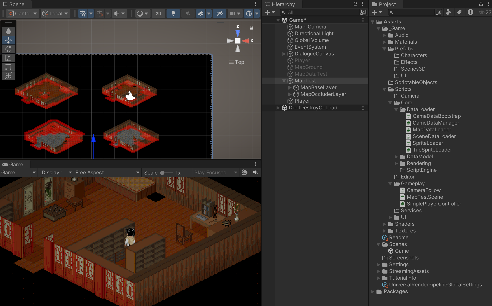

# PAL-HD2D

## 项目简介

PAL-HD2D 是基于 Unity 2022.3 LTS + URP 的仙剑奇侠传1 HD-2D 重制项目，全程使用 AI 驱动。

**开发策略**：采用"先 2D 完整流程跑通，再渐进式 3D 化"的开发路线。初期基于 3D 正交视角复刻原版 2D 游戏体验，后续逐步尝试搭建 3D 场景，实现 HD-2D 风格的视觉效果。

**技术特点**：
- 核心游戏逻辑层移植自 SDLPal-CS（C#），Unity 负责渲染和输入
- 脚本引擎完整移植原版 DSL 编译管线，支持原版剧情脚本
- Isometric 坐标系统与原版一致，保证碰撞检测和场景交互正确
- URP 后处理支持 Depth of Field、Bloom、Color Grading 等 HD-2D 效果


**2026.3.31进度**：渲染层级问题解决。

**2026.3.30进度**：碰撞问题解决。

**2026.3.29进度**：已完成第一个场景画面渲染、角色移动控制。


## 游戏截图


## 快速开始
1. 使用Unity 2022.3或更高版本打开项目
2. 加载Scenes/Game.unity场景
3. 点击播放按钮开始游戏

## 项目结构
```
PAL1_HD2D/
├── Assets/
│   ├── Scenes/              # 游戏场景
│   ├── Settings/            # 项目设置
│   ├── StreamingAssets/     # 流式资源
│   └── _Game/               # 游戏核心代码
└── .gitignore
```
